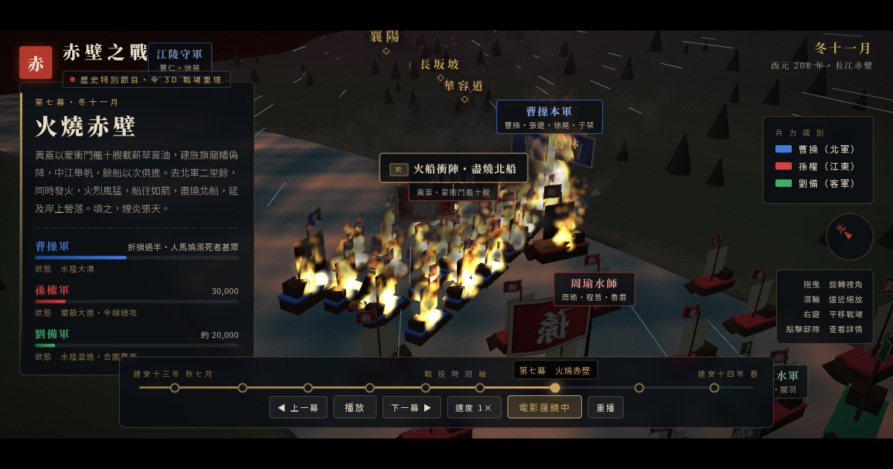

# 赤壁之戰 208 — 全 3D 戰場重現

> 以電視特別節目的 3D 運鏡與特效，重現西元 208 年的赤壁之戰。
> 單一 HTML 檔、零 build、零後端。

**Live Demo**: https://yazelin.github.io/red-cliffs-3d/



## 這是什麼

一個互動式的赤壁之戰 3D 戰場：九幕時間軸從「大軍南下」演到「天下三分」，
可以像歷史節目一樣自動播映（電影運鏡 + letterbox），也可以像遊戲一樣
隨時拖曳滑鼠接管鏡頭、自由探索戰場。

- **地形**：程序化生成的長江戰場——赤壁紅崖、烏林、夏口、漢水支流、華容道沼澤、江陵與襄陽城
- **三方兵力**：曹操藍、孫權紅、劉備綠；軍旗以「曹／孫／劉」大字呈現，遠看即可識別
- **時間軸九幕**：大軍南下 → 孫劉同盟 → 初戰赤壁 → 鐵索連環 → 苦肉計 → 東風驟起 → 火燒赤壁 → 敗走華容 → 天下三分
- **每一幕呈現**：陣型與移動方向（動態箭頭）、將領姓名、重大事件標注、三方戰力消長、艦隊狀態（正常／連環／著火／殘骸）
- **計策發動特效**：連環計、苦肉計、借東風、火攻——以全螢幕書法計策卡呈現，並區分「史」（正史）與「演義」（三國演義）
- **天氣與戰場特效**：東南風粒子流、GPU 火焰與濃煙、火光映江、箭雨與火矢（漢代無火炮，遠程武器以弓弩火矢呈現）、鏡頭震動
- **互動**：點擊任一部隊查看兵力與背景；時間軸可任意跳幕；速度 0.5× / 1× / 2×
- **語音旁白**：九幕白話旁白以志玲音色 TTS（CosyVoice 3 zero-shot voice clone）配音，隨幕自動播放、跟播放速度同步，可用「旁白」鈕開關

## 操作

| 操作 | 效果 |
|---|---|
| 拖曳 | 旋轉視角（會自動切出電影運鏡） |
| 滾輪 | 縮放 |
| 右鍵拖曳 | 平移 |
| 點擊部隊 | 查看部隊詳情 |
| 時間軸節點 | 跳到任一幕 |
| 「旁白」 | 開關語音旁白 |
| 「回到電影運鏡」 | 交還鏡頭給導播 |

建議使用桌面瀏覽器觀看。

## 技術

- [Three.js](https://threejs.org/) r160（CDN importmap，無 build step）
- 全部內容在單一 `index.html`（地形、單位、粒子、運鏡、UI、時間軸引擎）
- 地形：value-noise FBM 高度場 + 河道雕刻 + 頂點上色
- 火焰／濃煙：GPU 粒子（vertex shader 內以 seed + time 計算生命週期，CPU 零更新）
- 軍旗：Canvas 繪製書法字纹理 + 頂點波動
- 標籤：CSS2DRenderer（地名、部隊、事件卡）
- 字體：Noto Serif TC / Noto Sans TC

## 史料說明

- 兵力為史學常見估計：曹軍約二十餘萬（號稱八十萬）、周瑜三萬、劉備（含劉琦）約兩萬
- 事件標注分兩種：「史」見於《三國志》等正史；「演義」出自《三國演義》（如借東風、苦肉計、義釋曹操）
- 地理為示意性重建，非精確地圖

---

## 實驗記錄：這個 demo 是 AI 一次對話產生的

本 repo 的整個 demo（單一 HTML 檔、OG 圖、部署）由 **Claude Code 上的 Fable 5 模型（effort: medium）** 在一次對話中產生。以下忠實記錄過程。

### 原始 prompt（一字未改）

> 以電視特別節目的3D運鏡方式和特效來介紹赤壁之戰，把地形和地名、船艦等標示出來；曹操為藍色，孫權為紅色，劉備為綠色，以時間軸來顯示戰爭過程中各軍勢的陣型、移動方向、將領姓名、重大事件、各軍戰力、要有計策發動效果、槍炮和天氣、軍隊、船艦狀態的特效，看起來要像遊戲讓玩家可互動或歷史節目自動播放，應可自由移動照相機角度。各軍軍旗需可清楚識別。使用單一html檔完成，並部署到我的github repo pages 上。最終交付給我pages連結。

（後續追加：補上 SEO 與 OG 圖、把 prompt 與實驗過程記錄進 README、產生 FB 分享文。）

### 過程

1. **設計**：模型先決定美術方向（深墨金箔的歷史紀錄片質感、書法計策卡、letterbox 電影黑邊），再規劃 3D 架構：程序化地形、九幕時間軸資料驅動引擎、每幕運鏡腳本（line / orbit / follow 三種鏡頭）。
2. **一次寫出 ~1900 行的單一 HTML**，含地形生成、三方艦隊與軍團、GPU 火焰粒子、風場、箭雨、鐵索連環、計策卡 UI、時間軸引擎。
3. **自我驗證**：模型自己起本機 server，用 Chrome DevTools（MCP）開頁面、讀 console、逐幕截圖檢查。
4. **抓到並修掉的 bug**（全部是模型自己發現的）：
   - 地形程式碼殘留一行未閉合括號（語法錯誤，頁面直接掛）
   - `buildChains()` 寫了但忘記呼叫——鐵索連環沒有鎖鏈
   - 夏口城座標落在漢水河道裡（蓋在水上）
   - 火攻與燒營狀態寫在幕首 set，導致火燒赤壁一開幕就全軍著火——拆成時間軸事件，並另設快轉用的 scrubSet
   - three.js CSS2DRenderer 只檢查標籤自身 visible、不看父層 group——「黃蓋先鋒」標籤在登場前就飄在戰場上
   - 開場直書標題在小視窗會超出畫面
5. **OG 圖**：直接把 demo 跑到「火燒赤壁」那一幕、在火攻點燃後暫停，以 1200×630 視窗截圖存成 `og.png`。
6. **部署**：建 repo、推上 GitHub、開 Pages、驗證線上 URL。

模型對「槍炮」的處理：西元 208 年尚無火炮，自行改以弓弩、火矢與火船爆燃呈現遠程與爆炸特效，並在頁面與 README 中註明。

### 心得（忠實版）

- 一段中文需求 → 可玩的 3D 互動歷史節目，過程約一次對話，中途人工輸入只有兩段訊息（原始需求＋追加 SEO/README/FB 文需求）。
- 並非零修正：上面那 6 個 bug 都真實發生過，但都是模型在自我驗證迴圈中自己抓到、自己修掉的，沒有人工 debug。
- 美術、史料取捨（史／演義分流、兵力估計）、運鏡腳本全部由模型自行決定，沒有額外指示。

---

## FB 分享文（可直接複製）

```
用一段 prompt，讓 AI 做出一個 3D 互動的赤壁之戰

我給 Claude Code（Fable 5 模型，effort medium）一段需求：
用電視特別節目的 3D 運鏡介紹赤壁之戰，標出地形、地名、船艦，
曹操藍、孫權紅、劉備綠，用時間軸呈現陣型移動、將領、重大事件、
計策發動、天氣和艦隊狀態；要能像歷史節目自動播放，也要能像遊戲
自由轉鏡頭；軍旗要清楚可辨；全部裝進單一 HTML 檔，部署到 GitHub Pages。

它在一次對話裡交付了：

- 程序化生成的長江戰場：赤壁紅崖、烏林、夏口、漢水、華容道
- 九幕時間軸：大軍南下、孫劉同盟、初戰赤壁、鐵索連環、苦肉計、
  借東風、火燒赤壁、敗走華容、天下三分
- 計策卡和事件標注，還自己把「史」和「演義」分開標
- 火攻那一幕：火船衝陣、連環船延燒、東南風粒子、火光映江
- 電影運鏡自動播映，滑鼠一拖就切成自由視角

過程不是零修正。它自己用瀏覽器逐幕檢查，抓到六個 bug：
語法錯誤、鐵索寫了沒接上、夏口城蓋進河裡、火攻提早點燃、
部隊標籤不跟著隱藏、開場標題爆版——全部自己發現自己修掉，
我沒有 debug 過任何一行。

另一個細節：我寫了「槍炮」，它知道西元 208 年沒有火炮，
改用弓弩火矢和火船爆燃呈現，還在頁面上註明了這個取捨。

Demo（建議電腦開）：
https://yazelin.github.io/red-cliffs-3d/

原始 prompt、實驗記錄、原始碼都在 repo 裡：
https://github.com/yazelin/red-cliffs-3d
```

## License

MIT
